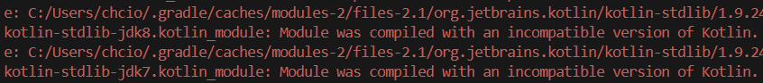

# COMMA: AI Learning Assistant

<!--Table of Contents-->
# Table of Contents
- [[1] Project Code Overview](#1-project-code-overview)
    - [Project Structure](#project-structure)
    - [Source Code Description](#source-code-description)
    - [Open Source and Tech Stack Used](#open-source-and-tech-stack-used)
- [[2] Getting Started](#2-getting-started)
    - [Prerequisites](#prerequisites)
    - [Installation and Setup](#installation-and-setup)
- [[3] Build and Run](#3-build-and-run)
    - [Build](#build)


<br><br>

# [1] Project Code Overview

## Project Structure
This project consists of a **Flutter-based frontend (COMMA)** and a **Node.js-based backend (SERVER)**.  
Below is the main directory and file structure:
```plaintext
COMMA
│      
├─COMMA
│  │  firebase.json
│  │  pubspec.lock
│  │  pubspec.yaml
│  │  README.md
│  │
│  ├─assets
│  │          
│  ├─lib
│  │  │  10_typeselect.dart
│  │  │  12_hompage_search.dart
│  │  │  16_homepage_move.dart
│  │  │  17_allFilesPage.dart
│  │  │  1_Splash_green.dart
│  │  │  2_onboarding-1.dart
│  │  │  30_folder_screen.dart
│  │  │  31_full_folder_list_screen.dart
│  │  │  33_mypage_screen.dart
│  │  │  3_onboarding-2.dart
│  │  │  4_onboarding-3.dart
│  │  │  60prepare.dart
│  │  │  62lecture_start.dart
│  │  │  63record.dart
│  │  │  66colon.dart
│  │  │  components.dart
│  │  │  firebase_options.dart
│  │  │  main.dart
│  │  │  
│  │  ├─api
│  │  │      api.dart
│  │  │      
│  │  ├─env
│  │  │      env.dart
│  │  │      env.g.dart
│  │  │      
│  │  ├─folder
│  │  │      37_folder_files_screen.dart
│  │  │      38_folder_list.dart
│  │  │      39_folder_section.dart
│  │  │      
│  │  ├─model
│  │  │      44_font_size_provider.dart
│  │  │      45_theme.dart
│  │  │      user.dart
│  │  │      user_provider.dart
│  │  │      
│  │  ├─mypage
│  │  │      42_help_page.dart
│  │  │      43_accessibility_settings.dart
│  │  │      44_font_size_page.dart
│  │  │      
│  │  └─user
│  │          user_pref.dart                  
│              
└─SERVER
    │  google-services.json
    │  index.js
    │  package-lock.json
    │  package.json
```
<br>

<br>

## Source Code Description

COMMA provides three core features to support visually and hearing-impaired learners:

1) **Automatic Alternative Text Generation** for lecture materials
2) **Real-time Captioning** with improved keyword accuracy
3) **Colon (:) Alternative Learning Material Generation**, which matches lecture slides with caption scripts

Below is a detailed explanation of the key files and code related to each feature.
<br><br>

### (1) Automatic Alternative Text Generation

This feature sends the uploaded lecture materials to the GPT-4o API to generate alternative text descriptions.  
Users can view the results directly on the app screen.
<br><br>

#### Related Files

The main files related to this feature are as follows:
- `env.g.dart`: Stores the OpenAI API key used for accessing the GPT-4o API
- `60prepare.dart`: Handles lecture material uploads, stores them in the database, and calls the GPT-4o API to generate alternative text
- `63record.dart`: Displays the generated alternative text to the user  
  <br><br>

#### Key Function Explanation

- **`Future<List<String>> uploadImagesToFirebase(List<Uint8List> images, int userKey)`**
    - **Purpose**: Uploads lecture material images to Firebase Storage and returns a list of their download URLs.
    - **How it works**:
        1. Each image is uploaded to Firebase Storage.
        2. The upload progress is updated via `_progressNotifier`.
        3. Once complete, download URLs are saved and returned as a list.

<br>

- **`Future<String> callChatGPT4APIForAlternativeText(List<String> imageUrls, int userKey, String lectureFileName)`**
    - **Purpose**: Calls the GPT-4o API to generate alternative text for each lecture slide (image), uploads the generated results to Firebase Storage, and returns the final result file's URL.
    - **How it works**:
        1. For each image URL, the function calls the GPT-4o API to generate corresponding alternative text.
        2. The generated text is saved as a file and uploaded to Firebase Storage.
        3. The URLs of these text files are saved to the database.
        4. After processing all images, a final merged text file is created.
        5. Returns the download URL of the final merged alternative text file.

<br><br>

### (2) Real-time Captioning

This feature performs keyword boosting based on key terms extracted from uploaded lecture materials, enabling the generation of more accurate real-time captions that reflect the content of the lecture.
<br><br>

#### Related Files

The main files related to this feature are as follows:
- `60prepare.dart`: Handles lecture material uploads, stores them in the database, and calls the GPT-4o API to extract key lecture keywords.
- `63record.dart`: Implements functionality for setting the Deepgram STT API key, starting the recording, generating real-time captions, and stopping the recording.
  <br><br>

#### Key Function Descriptions

- **`Future<List<String>> callChatGPT4APIForKeywords(List<String> imageUrls)`**
    - **Purpose**: Calls the GPT-4o API to extract key keywords from uploaded lecture slide images. The extracted keywords are de-duplicated, saved to Firebase, and stored in the database.
    - **How it works**:
        1. Calls the GPT-4o API for each image URL to extract relevant keywords.
        2. Removes duplicate keywords and uploads them to Firebase.
        3. Saves the URL of the uploaded keyword file to the database.
        4. Returns the final list of extracted keywords.

<br>

- **`void _startRecording()`**
    - **Purpose**: Starts audio recording and initializes real-time speech recognition.
    - **How it works**:
        1. Sets the recording status to `recording` and updates the UI accordingly.
        2. Initializes the audio stream for real-time transcription.
        3. Starts the recorder to begin capturing voice input.

<br>

- **`void _stopRecording()`**
    - **Purpose**: Stops the recording, processes any remaining audio into final text, and stores it in the database.
    - **How it works**:
        1. Stops the recording and updates the status to `recorded`.
        2. Processes any remaining untranscribed audio into final text.
        3. Records the timestamp for the completed recording.

<br><br>

### (3) Colon File Generation

This feature matches the uploaded lecture slides with the class caption script, then segments and displays the captions corresponding to each individual lecture slide page.
<br><br>

#### Related Files

The main file related to this feature is as follows:
- `63record.dart`: Contains the logic for sending both the lecture material and caption script to the GPT-4o API to generate the Colon file.
  <br><br>

#### Key Function Description

- **`Future<bool> callChatGPT4API(String pageText1, String pageText2, String scriptText)`**
    - **Purpose**: Compares the texts of two lecture slide pages with the caption script to determine which page the script belongs to.
    - **How it works**:
        1. Calls the GPT-4o API to analyze and determine which page the script text corresponds to.
        2. Returns `true` if the result is `"isNext"`, and `false` if the result is `"isNotNext"`.


<br><br>

## Open Source and Tech Stack Used

This project is built using the following open-source tools and external services:

### 1. Frameworks and Languages
- **Flutter**: Cross-platform app development framework.
- **Node.js**: JavaScript runtime environment for backend development.

### 2. External APIs
- **OpenAI API**: Used for alternative text generation and script analysis with the GPT-4o model.
- **Deepgram STT API**: Used for real-time speech-to-text processing.

### 3. Database and Storage
- **Firebase**: For file storage and user data management.
- **MySQL**: Used to store lecture materials, keywords, alternative texts, and more.

### 4. Utilities and Libraries
- **http**: HTTP client in Flutter for REST API calls.
- **provider**: For state management and data sharing in Flutter.
- **Express.js**: For RESTful API development and routing.
  <br><br><br>

# [2] Getting Started

This tutorial assumes a **Windows OS** environment and an **Android device/emulator** for testing.
<br>

## Prerequisites

- [Install Node.js](https://nodejs.org/en/download/package-manager)
- [Install Android Studio](https://developer.android.com/studio?hl=en)
- [Install Flutter](https://docs.flutter.dev/release/archive?tab=windows)
    - [Setup guide for Android Studio and Flutter](https://www.geeksforgeeks.org/android-studio-setup-for-flutter-development/)

- [Get your OpenAI API Key](https://platform.openai.com/): Required for using GPT-4o API
    - [Helpful Website)](https://community.openai.com/t/how-do-i-get-my-api-key/29343)
- Android Device: Physical Android device or emulator
  <br><br>

## Installation and Setup

### 1. Clone the Project
```bash
git init

git clone https://github.com/jxy082/COMMA.git
```


<br>


### 2. Install Packages
```bash
cd COMMA/COMMA

flutter pub get
flutter pub outdated
flutter pub upgrade --major-versions
```
<br>

### 3. Set Your OpenAI API Key
Set your issued OpenAI API Key in **lib/env/env.g.dart**

```bash
# lib/env/env.g.dart
static const String apiKey =
      'YOUR_API_KEY';
```


<br><br>


# [3] Build and run
## Build
```bash
# COMMA/COMMA
flutter build apk --release
```

<br>


<br>
※ During the build process, some warning messages may appear in the terminal, but the build will still complete successfully..
<br>



<br>
※ If a build error occurs, try running the following commands before building again.
<br>

```bash
flutter clean

flutter pub get
flutter pub outdated
flutter pub upgrade --major-versions
```


<br><br>
